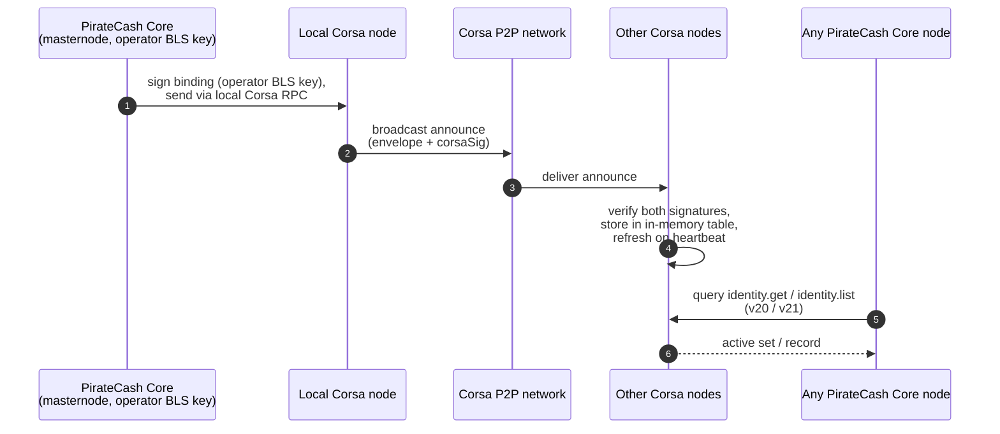
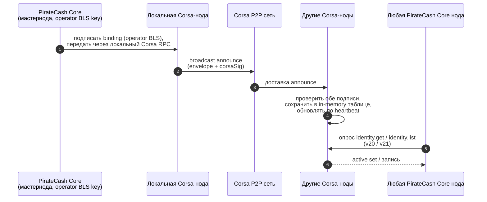

PIP-0002: Off-chain Corsa Identity Announce
===========================================

| Field | Value |
| ----- | ----- |
| PIP | 0002 |
| Title | Off-chain Corsa Identity Announce |
| Status | Draft |
| Type | Standards Track |
| Layer | Corsa network / Masternode services |
| Created | 2026-05-01 |
| Related to | PIP-0001 (stage 2 / stage 3) |
| Corsa repository | <https://github.com/piratecash/corsa/> |

> This proposal describes what Corsa must implement so that the binding
> `masternode operator key ↔ Corsa identity` becomes observable on the
> network without changing PirateCash Core consensus rules. The
> proposal deliberately does not modify `protx` and does not require
> a hardfork.

## English

### Goal

Make the binding `masternode operator key ↔ Corsa identity public key`
observable and verifiable on the Corsa network without writing identity
into the PirateCash blockchain. This binding is required for:

- PIP-0001 stage 2 — network-visible Corsa availability checks;
- PIP-0001 stage 3 — PoSe enforcement (penalties for missing service);
- future routing of messenger traffic to a specific operator.

### Why off-chain instead of `protx`

The alternative is to extend `ProTx` with a new `corsaIdentity` field
and forbid duplicates at the consensus level. That option was
considered and rejected for the following reasons:

- PIP-0001 explicitly states that Corsa must evolve independently of
  Core; embedding the identity field into `ProTx` ties the identity
  format to PirateCash consensus rules.
- Any change to the identity schema would require a hardfork.
- The codebase diverges further from upstream Dash, making every merge
  more painful.
- Rotating a compromised Corsa key becomes expensive (separate
  on-chain transaction with confirmations and fees).
- For PoSe, deterministic on-chain consensus over identity is not
  required — gossipable signed observability is enough.

If a future stage requires deterministic global consensus over the
identity (for example, routing through a deterministic quorum), the
`ProTx` extension remains an option that can be introduced via a
protocol bump.

### High-level flow



Steps:

1. PirateCash Core signs a binding message with the operator BLS key
   and submits it to the local Corsa node via its RPC.
2. The Corsa node adds its own signature with the Corsa identity key
   and broadcasts the announce over the Corsa P2P network.
3. Each Corsa node, upon receiving the announce, verifies both
   signatures and stores `(proRegTxHash, operatorPubKey, corsaPubKey,
   lastSeen, expiresAt)` in an in-memory table.
4. Any PirateCash Core node can query its **local** Corsa node via RPC
   to learn whether the network sees this masternode as alive.

### Wire format of the announce message

The message consists of two signed parts: the binding (operator side)
and the envelope (Corsa node side).

#### Binding (signed by PirateCash Core)

Fields covered by the operator signature:

```
binding := {
  version:        uint16,           // format version, starts at 1
  proRegTxHash:   bytes32,          // hash of the masternode ProRegTx
  operatorPubKey: bls_pubkey,       // 48 bytes, BLS on BLS12-381
  corsaPubKey:    ed25519_pubkey,   // 32 bytes, Corsa identity key
  blockHeight:    uint32,           // recent PirateCash height
  blockHash:      bytes32,          // block hash at this height
  validUntil:     uint32,           // height up to which the binding is valid
}
operatorSig := BLS_sign(operatorPrivKey, hash(binding))
```

`blockHeight` and `blockHash` provide replay protection — a stale
binding is rejected (see "Aging and replay").

#### Envelope (signed by the Corsa node)

The Corsa node adds heartbeat metadata and signs them with its
identity key:

```
envelope := {
  binding:     binding,
  operatorSig: bls_signature,       // 96 bytes
  emittedAt:   uint64,              // unix timestamp ms, local
  nonce:       bytes16,             // random, for deduplication
}
corsaSig := Ed25519_sign(corsaPrivKey, hash(envelope))
announce := { envelope, corsaSig }
```

The double signature is fundamental: one part proves the operator
controls the masternode, the other proves the Corsa node actually owns
the claimed identity. Without both signatures the announce is
discarded.

#### Serialization

Use the same binary wire format already adopted by Corsa P2P. If Corsa
uses CBOR / msgpack / its own TLV — follow the existing convention to
avoid introducing a new serializer.

### What Corsa must implement

This is the main part of the document — the task list for the Corsa
team.

#### 1. New RPC: `identity.announce`

`POST /rpc/v1/exec` with command `identity.announce`. Accepts the
following body:

```json
{
  "binding": "<hex>",
  "operatorSig": "<hex>"
}
```

Behavior:

- validate the binary format of `binding`;
- check that `blockHeight`/`blockHash` match the known PirateCash chain
  (via the local PirateCash node or an embedded light client; see open
  question 1);
- verify the BLS signature of the operator key over `binding`;
- on success — assemble the `envelope`, sign it with the Corsa node
  Ed25519 key, store locally and broadcast over P2P.

The command is invoked locally by PirateCash Core when the masternode
starts and before each heartbeat (see item 5).

#### 2. New P2P message type: `corsa_announce`

Distributed over the same gossip overlay as ordinary messenger
messages, but in a separate sub-channel so that identity traffic does
not compete with user messages.

Receive-side handling rules:

- check the message size (see limits in item 7);
- verify both signatures: operator BLS and Corsa Ed25519;
- check `blockHeight`/`blockHash` against the known PirateCash chain;
- check that `proRegTxHash` actually matches a valid, non-banned
  masternode;
- if a record for this `proRegTxHash` already exists — apply the
  tie-break rule (see item 4);
- store in the in-memory table;
- relay to peers (standard gossip with TTL).

#### 3. In-memory identity table

Structure:

```
key   = proRegTxHash
value = {
  operatorPubKey,
  corsaPubKey,
  binding,
  operatorSig,
  envelope,
  corsaSig,
  firstSeen: ts,
  lastSeen:  ts,
  expiresAt: ts,
}
```

Requirements:

- no persistence across Corsa node restarts (state is rebuilt from
  gossip within 1-2 heartbeat cycles);
- memory bound: O(number of active masternodes) — tens of thousands of
  records in the worst case; record size ~300-500 bytes;
- thread-safe access from the RPC handler and the P2P handler.

#### 4. Tie-break rule for duplicate identities

Two collisions are possible:

- two different `proRegTxHash` values claim the same `corsaPubKey` —
  treated as an error; both records are marked `disputed` and **not**
  returned as valid via RPC until the conflict is gone;
- a single `proRegTxHash` sends a new announce with a different
  `corsaPubKey` — the **last-signed wins** rule applies: the record
  with the higher `blockHeight` in `binding` replaces the older one
  (with rollback protection, see below).

Last-signed-wins lets the operator rotate the Corsa key without
on-chain actions. Rollback protection: a new record is accepted only
if `new.blockHeight > old.blockHeight` and at the same time
`new.blockHeight - old.blockHeight ≥ MIN_ROTATION_GAP` (for example,
60 blocks ≈ 2.5 minutes at 2.5 min/block).

#### 5. Heartbeat

The Corsa node must periodically (recommendation: every 30 minutes)
re-broadcast its own announce, even if the binding has not changed,
updating only `emittedAt`/`nonce` and `corsaSig` — the operator
binding stays the same while it is valid.

Receivers update `lastSeen` without touching `binding`.

#### 6. RPC for state queries

Add at least two commands:

- `identity.get` — `{ proRegTxHash }` → table record or `null`;
- `identity.list` — paginated list of all known identities with
  filters (`activeOnly`, `seenSince`).

These commands are needed by PirateCash Core for stages 2 and 3 of
PIP-0001:

- v20 (stage 2) — Core periodically queries the local Corsa node and
  logs / surfaces to the operator whether the network sees its
  binding;
- v21 (stage 3) — Core builds the PoSe penalty decision based on
  whether the masternode binding has been visible in the Corsa
  network for the last N blocks.

#### 7. Aging and replay

`expiresAt = firstSeen + TTL`, where TTL = 2 hours.

Do not accept an announce whose `binding.blockHeight` is older than
`current_height - REPLAY_WINDOW` (recommendation: 30 blocks).

Do not accept an announce whose `binding.blockHash` does not match the
known block hash at this height (protection against fork spoofing).

`validUntil` in the binding protects against the situation where, after
operator key rotation, the old binding keeps circulating on the
network.

#### 8. Anti-flood / limits

- `announce` size — fixed upper bound (≈ 2 KB);
- per-peer rate limit on `corsa_announce`: no more than one announce
  per `proRegTxHash` per `MIN_REBROADCAST_INTERVAL` (e.g. 5 minutes);
- per-peer limit on new `proRegTxHash` values per minute — protection
  against flooding with fake masternodes;
- if an announce references a `proRegTxHash` that does not exist in
  the PirateCash chain — drop without relaying;
- if an announce is signed with an operator key that does not match
  the operator key from ProRegTx — drop.

### What is needed from PirateCash Core (briefly)

For Corsa to validate announces, it needs access to the current
masternode list and to recent block headers. Two options:

- **A.** The Corsa node calls the local PirateCash Core via RPC
  (`protx list`, `getblockhash`, `getblockheader`). Simple option,
  but requires Corsa to parse and cache the responses.
- **B.** PirateCash Core pushes changes to Corsa via ZMQ or a new RPC
  (`corsa.notifyMasternodes`). Cleaner, but requires Core changes.

As a baseline this proposal accepts option **A**; **B** is left as
an improvement in v20 alongside stage 2 of PIP-0001.

On the PirateCash Core side, the following is added:

- generation of `binding` with operator key signing;
- invocation of `identity.announce` on the local Corsa RPC at
  masternode startup;
- periodic re-announce on key rotation or when `validUntil` expires;
- (stage 2) polling `identity.get` for self-check;
- (stage 3) using `identity.list` for PoSe decisions.

These changes do **not** touch consensus rules — they live at the
masternode logic level, similar to the existing Corsa check from
PIP-0001 stage 1.

### Security

- **Sybil**: an announce with an arbitrary `corsaPubKey` and no
  operator signature is dropped. Without the masternode operator key,
  an attacker cannot claim someone else's identity.
- **Replay**: the bundle `blockHeight + blockHash + validUntil` plus
  `REPLAY_WINDOW` limits the lifetime of a binding.
- **Rollback**: the `MIN_ROTATION_GAP` rule protects against the
  situation where an attacker with an older key tries to "roll back"
  the identity.
- **DoS via gossip**: limits from item 8 plus standard per-peer ban
  mechanisms.
- **PrivKey leak**: the operator must be able to invalidate a
  binding; for that we introduce `binding.tombstone = true` (an
  announce without `corsaPubKey`, which invalidates the previous
  record and is also relayed across the network).

### Open questions

1. **Source of truth about masternodes for Corsa**: option A (RPC to
   the local Core) or option B (push via ZMQ)? The amount of work on
   the Corsa side depends on this.
2. **Corsa identity signature algorithm**: Ed25519 is proposed as the
   simplest option. If Corsa already has its own cryptosystem — use
   that.
3. **TTL and intervals**: 2 hours / 30 minutes / 30 blocks are
   starting suggestions and require tuning on testnet.
4. **Tombstone message**: format is not yet specified — decide
   whether a separate wire message is needed or whether a binding
   with an empty `corsaPubKey` is enough, before implementation
   begins.
5. **Compatibility with stage 3 of PIP-0001**: needs to be decided
   whether "visible in Corsa" is treated as "service is working" or
   stage 3 will require an additional proof-of-service on top of the
   announce.

### Roadmap (proposal)

| # | Task | Repository | PIP-0001 stage |
| - | ---- | ---------- | -------------- |
| 1 | Agree on wire format and signature algorithms | corsa + core | preparation for v20 |
| 2 | Implement `identity.announce` RPC in Corsa | corsa | v20 |
| 3 | Implement P2P `corsa_announce` + table | corsa | v20 |
| 4 | Implement `identity.get` / `identity.list` | corsa | v20 |
| 5 | Implement binding generation in Core | piratecash | v20 |
| 6 | Self-check Core ↔ local Corsa node | piratecash | v20 |
| 7 | Tombstone mechanism | corsa + core | v20 |
| 8 | PoSe scoring based on `identity.list` | piratecash | v21 |

### References

- [PIP-0001](pip-0001.md) — Masternode Messenger Service Integration.
- Corsa repository: <https://github.com/piratecash/corsa/>
- Dash DIP-0003 (for ProTx and operator key reference): not in scope
  of this PIP, mentioned as context.

## Русский

### Цель

Сделать связку `operator key мастерноды ↔ публичный ключ Corsa identity`
наблюдаемой и проверяемой в сети Corsa, без записи identity в блокчейн
PirateCash. Эта связка нужна для:

- этапа 2 PIP-0001 — сетевые проверки доступности Corsa,
- этапа 3 PIP-0001 — PoSe enforcement (пенальти за отсутствие сервиса),
- маршрутизации сообщений мессенджера на конкретного оператора в будущем.

### Почему off-chain, а не через `protx`

Альтернатива — расширить `ProTx` новым полем `corsaIdentity` и запретить
дубликаты на уровне consensus. Этот вариант рассмотрен и отклонён по
следующим причинам:

- PIP-0001 явно фиксирует, что Corsa эволюционирует независимо от Core, а
  поле в `ProTx` прибивает формат identity к consensus rules PirateCash;
- любое изменение схемы identity потребует hardfork;
- расхождение с upstream Dash растёт, каждый merge становится сложнее;
- ротация скомпрометированного Corsa-ключа становится дорогой (отдельная
  транзакция с подтверждениями и комиссией);
- для PoSe детерминированный on-chain консенсус по identity не нужен —
  достаточно gossipable signed observability.

Если в будущем потребуется глобальный детерминированный консенсус
(например, маршрутизация через детерминированный кворум), вариант с
расширением `ProTx` остаётся открытым и может быть введён через
протокол-бамп.

### Высокоуровневый поток



Шаги:

1. PirateCash Core подписывает binding-сообщение operator BLS-ключом и
   передаёт его в локальную Corsa-ноду через её RPC.
2. Corsa-нода добавляет к binding собственную подпись Corsa-ключом и
   рассылает announce по своей P2P-сети.
3. Каждая Corsa-нода, получив announce, проверяет обе подписи и
   сохраняет запись `(proRegTxHash, operatorPubKey, corsaPubKey,
   lastSeen, expiresAt)` в in-memory таблице.
4. PirateCash Core может опросить **локальную** Corsa-ноду через RPC,
   чтобы узнать, видит ли сеть данную мастерноду как живую.

### Wire format announce-сообщения

Сообщение состоит из двух подписанных частей: binding (операторская
сторона) и envelope (сторона Corsa-ноды).

#### Binding (подписывает PirateCash Core)

Поля, которые попадают под operator-подпись:

```
binding := {
  version:        uint16,           // версия формата, начинаем с 1
  proRegTxHash:   bytes32,          // хэш ProRegTx мастерноды
  operatorPubKey: bls_pubkey,       // 48 байт, BLS на BLS12-381
  corsaPubKey:    ed25519_pubkey,   // 32 байта, ключ Corsa identity
  blockHeight:    uint32,           // недавняя высота PirateCash
  blockHash:      bytes32,          // хэш блока на этой высоте
  validUntil:     uint32,           // высота, до которой binding валиден
}
operatorSig := BLS_sign(operatorPrivKey, hash(binding))
```

`blockHeight` и `blockHash` дают replay protection — устаревший binding
не примут (см. раздел "Старение и replay").

#### Envelope (подписывает Corsa-нода)

Corsa-нода добавляет heartbeat-метаданные и подписывает их своим
identity-ключом:

```
envelope := {
  binding:     binding,
  operatorSig: bls_signature,       // 96 байт
  emittedAt:   uint64,              // unix timestamp ms, локально
  nonce:       bytes16,             // случайный, для дедупликации
}
corsaSig := Ed25519_sign(corsaPrivKey, hash(envelope))
announce := { envelope, corsaSig }
```

Двусторонняя подпись принципиальна: одна часть доказывает, что
operator контролирует мастерноду, вторая — что Corsa-нода действительно
владеет заявленным identity. Без обеих подписей announce
отбрасывается.

#### Сериализация

Использовать тот же бинарный wire format, что уже принят в Corsa P2P.
Если Corsa использует CBOR / msgpack / собственный TLV — следовать
существующему соглашению, чтобы не вводить новый сериализатор.

### Что должна реализовать Corsa

Это основная часть документа — список задач для команды Corsa.

#### 1. Новый RPC: `identity.announce`

`POST /rpc/v1/exec` с командой `identity.announce`. Принимает тело:

```json
{
  "binding": "<hex>",
  "operatorSig": "<hex>"
}
```

Поведение:

- проверить корректность бинарного формата `binding`;
- проверить, что `blockHeight`/`blockHash` соответствуют известной
  PirateCash-цепочке (через локальную PirateCash-ноду или встроенный
  light-client; см. открытый вопрос 1);
- проверить BLS-подпись operator-ключа над `binding`;
- если всё ок — собрать `envelope`, подписать Ed25519-ключом Corsa-ноды,
  сохранить локально и broadcast'ить по P2P.

Команда вызывается локально PirateCash Core при старте мастерноды и
перед каждым heartbeat (см. п. 5).

#### 2. Новый P2P-тип сообщения: `corsa_announce`

Распространяется по той же gossip-overlay, что и обычные сообщения
мессенджера, но в отдельном sub-channel, чтобы трафик identity не
конкурировал с пользовательскими сообщениями.

Правила обработки на приёме:

- проверить размер сообщения (см. лимиты в п. 7);
- проверить обе подписи: operator BLS и corsa Ed25519;
- проверить `blockHeight`/`blockHash` против известной PirateCash-цепи;
- проверить, что `proRegTxHash` действительно соответствует валидной,
  не банутой мастерноде;
- если запись по этому `proRegTxHash` уже есть — применить правило
  тай-брейка (см. п. 4);
- сохранить в in-memory таблицу;
- ретранслировать соседям (стандартный gossip с TTL).

#### 3. In-memory таблица identities

Структура:

```
key   = proRegTxHash
value = {
  operatorPubKey,
  corsaPubKey,
  binding,
  operatorSig,
  envelope,
  corsaSig,
  firstSeen: ts,
  lastSeen:  ts,
  expiresAt: ts,
}
```

Требования:

- никакой персистентности между рестартами Corsa-ноды (state
  пересобирается из gossip за 1-2 heartbeat-цикла);
- ограничение по памяти: O(числа активных мастернод) — десятки тысяч
  записей в худшем случае; запись ~300-500 байт;
- thread-safe доступ из RPC-обработчика и P2P-обработчика.

#### 4. Правило тай-брейка при дубликатах identity

Возможны две коллизии:

- два разных `proRegTxHash` заявляют одинаковый `corsaPubKey` —
  считается ошибкой; обе записи помечаются `disputed` и **не**
  возвращаются как валидные через RPC, пока конфликт не уйдёт;
- один `proRegTxHash` присылает новый announce с другим `corsaPubKey` —
  применяется правило **last-signed wins**: запись с более свежим
  `blockHeight` в `binding` заменяет старую (с защитой от отката, см.
  ниже).

Last-signed wins позволяет оператору ротировать Corsa-ключ без
on-chain действий. Защита от отката: новая запись принимается, только
если `new.blockHeight > old.blockHeight` и при этом
`new.blockHeight - old.blockHeight ≥ MIN_ROTATION_GAP` (например, 60
блоков ≈ 2.5 минуты при 2.5 мин/блок).

#### 5. Heartbeat

Corsa-нода должна периодически (рекомендация: каждые 30 минут)
повторно ретранслировать собственный announce, даже если binding не
менялся, обновляя только `emittedAt`/`nonce` и `corsaSig` — operator
binding остаётся тем же, пока он валиден.

Получатели обновляют `lastSeen`, не трогая `binding`.

#### 6. RPC для опроса состояния

Добавить минимум две команды:

- `identity.get` — `{ proRegTxHash }` → запись из таблицы или `null`;
- `identity.list` — пагинированный список всех известных identity с
  фильтрами (`activeOnly`, `seenSince`).

Эти команды нужны PirateCash Core для этапов 2 и 3 PIP-0001:

- v20 (этап 2) — Core периодически опрашивает локальную Corsa-ноду и
  логирует / показывает оператору, видит ли сеть его binding;
- v21 (этап 3) — Core строит решение о PoSe-пенальти на основе того,
  виден ли binding мастерноды в Corsa-сети за последние N блоков.

#### 7. Старение и replay

`expiresAt = firstSeen + TTL`, где TTL = 2 часа.

Не принимать announce с `binding.blockHeight`, который старше
`current_height - REPLAY_WINDOW` (рекомендация: 30 блоков).

Не принимать announce, если `binding.blockHash` не совпадает с
известным хэшем блока на этой высоте (защита от спуфинга на форке).

`validUntil` в binding защищает от того, что после ротации
operator-ключа старый binding продолжит ходить по сети.

#### 8. Антифлуд / лимиты

- размер `announce` — фиксированная верхняя граница (≈ 2 KB);
- per-peer rate limit на `corsa_announce`: не больше 1 announce на
  `proRegTxHash` за `MIN_REBROADCAST_INTERVAL` (например, 5 минут);
- per-peer лимит на новые `proRegTxHash` в минуту — защита от заливки
  фейковыми мастернодами;
- если announce ссылается на `proRegTxHash`, не существующий в
  PirateCash-цепи — отбрасывать без ретрансляции;
- если announce подписан operator-ключом, не совпадающим с
  operator-ключом из ProRegTx — отбрасывать.

### Что нужно от PirateCash Core (кратко)

Чтобы Corsa могла валидировать announce, ей нужен доступ к актуальному
masternode list и к недавним заголовкам блоков. Вариантов два:

- **A.** Corsa-нода ходит в локальную PirateCash Core по RPC
  (`protx list`, `getblockhash`, `getblockheader`). Простой вариант,
  но требует, чтобы Corsa умела парсить ответы и кэшировать их.
- **B.** PirateCash Core push'ит изменения в Corsa через ZMQ или новый
  RPC (`corsa.notifyMasternodes`). Чище, но требует доработок Core.

Как baseline в этом предложении принимаем вариант **A**; **B**
оставляем как улучшение в v20 одновременно с этапом 2 PIP-0001.

Со стороны PirateCash Core добавляются:

- генерация `binding` с подписью operator-ключом;
- вызов `identity.announce` локального Corsa RPC при старте мастерноды;
- периодический re-announce при ротации ключа или при истечении
  `validUntil`;
- (этап 2) опрос `identity.get` для self-check;
- (этап 3) использование `identity.list` для PoSe-решений.

Эти изменения **не** трогают consensus rules — они идут на уровне
masternode-логики, аналогично текущей проверке Corsa из этапа 1
PIP-0001.

### Безопасность

- **Sybil**: announce с произвольным `corsaPubKey` без operator-подписи
  отбрасывается. Без operator-ключа мастерноды злоумышленник не может
  заявить чужой identity.
- **Replay**: связка `blockHeight + blockHash + validUntil` плюс
  `REPLAY_WINDOW` ограничивает время жизни binding.
- **Rollback / откат**: правило `MIN_ROTATION_GAP` защищает от ситуации,
  когда злоумышленник со старым ключом пытается "откатить" identity.
- **DoS через gossip**: лимиты из п. 8 + стандартные механизмы
  per-peer ban.
- **Утечка PrivKey**: оператор должен иметь возможность аннулировать
  binding; для этого вводим `binding.tombstone = true` (announce без
  `corsaPubKey`, который инвалидирует предыдущую запись и тоже
  ретранслируется по сети).

### Открытые вопросы

1. **Источник правды о масс-мастернодах в Corsa**: вариант A
   (RPC к локальной Core) или B (push через ZMQ)? От этого зависит
   объём работы на стороне Corsa.
2. **Алгоритм подписи Corsa identity**: предложен Ed25519 как самый
   простой вариант. Если у Corsa уже есть собственная криптосистема —
   использовать её.
3. **TTL и интервалы**: значения 2 часа / 30 минут / 30 блоков — это
   стартовые предложения, требуют тюнинга на testnet.
4. **Tombstone-сообщение**: формат пока не специфицирован, нужен ли
   отдельный wire-message или достаточно binding с пустым
   `corsaPubKey` — решить до начала имплементации.
5. **Совместимость с этапом 3 PIP-0001**: нужно решить, считается ли
   "виден в Corsa" эквивалентом "сервис работает", или этап 3 будет
   требовать ещё дополнительный proof-of-service поверх announce.

### План работ (предложение)

| # | Задача | Репозиторий | Этап PIP-0001 |
| - | ------ | ----------- | ------------- |
| 1 | Согласовать wire format и алгоритмы подписей | corsa + core | подготовка к v20 |
| 2 | Реализовать `identity.announce` RPC в Corsa | corsa | v20 |
| 3 | Реализовать P2P `corsa_announce` + таблицу | corsa | v20 |
| 4 | Реализовать `identity.get` / `identity.list` | corsa | v20 |
| 5 | Реализовать формирование binding в Core | piratecash | v20 |
| 6 | Self-check Core ↔ локальная Corsa-нода | piratecash | v20 |
| 7 | Tombstone-механизм | corsa + core | v20 |
| 8 | PoSe scoring на основе `identity.list` | piratecash | v21 |

### Ссылки

- [PIP-0001](pip-0001.md) — Masternode Messenger Service Integration.
- Corsa repository: <https://github.com/piratecash/corsa/>
- Dash DIP-0003 (для референса по ProTx и operator key): не входит в
  scope этого PIP, упоминается как контекст.
